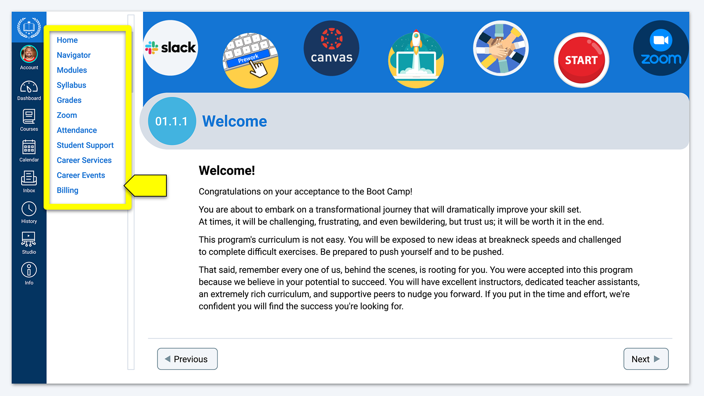
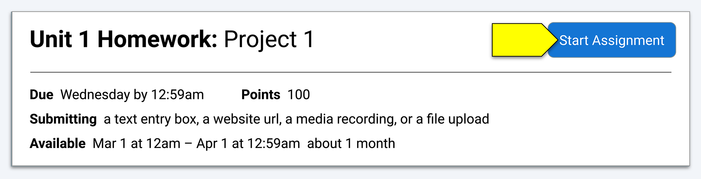
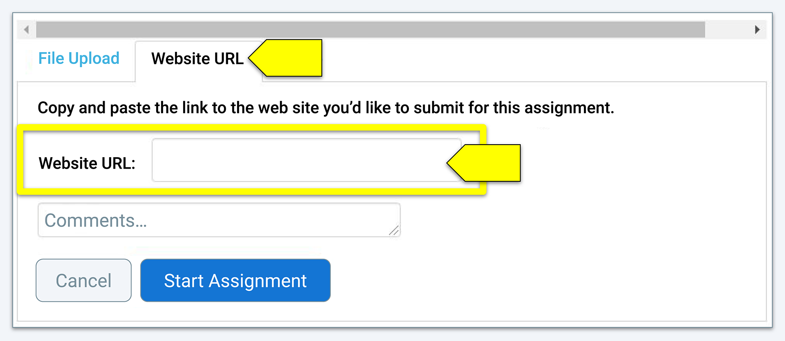
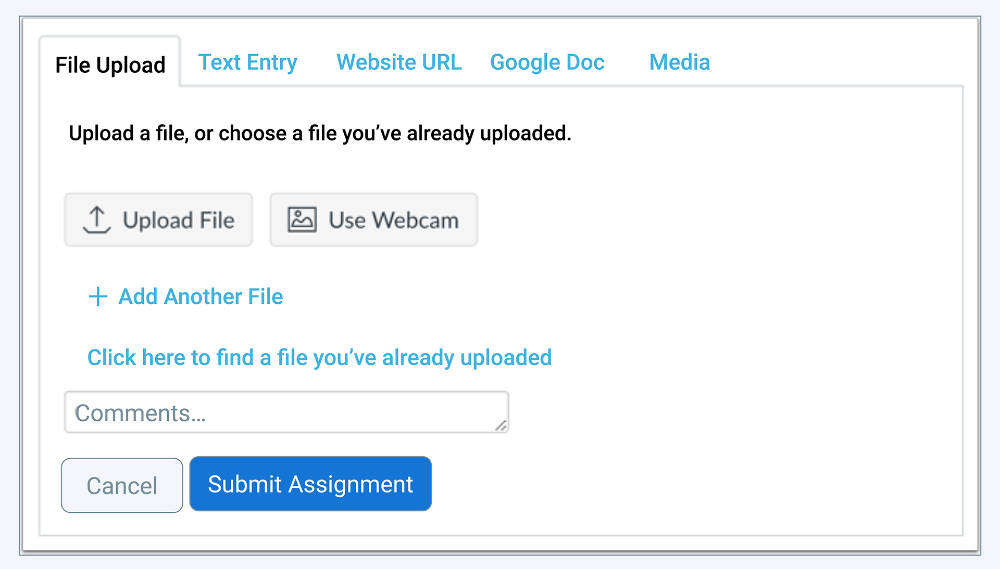
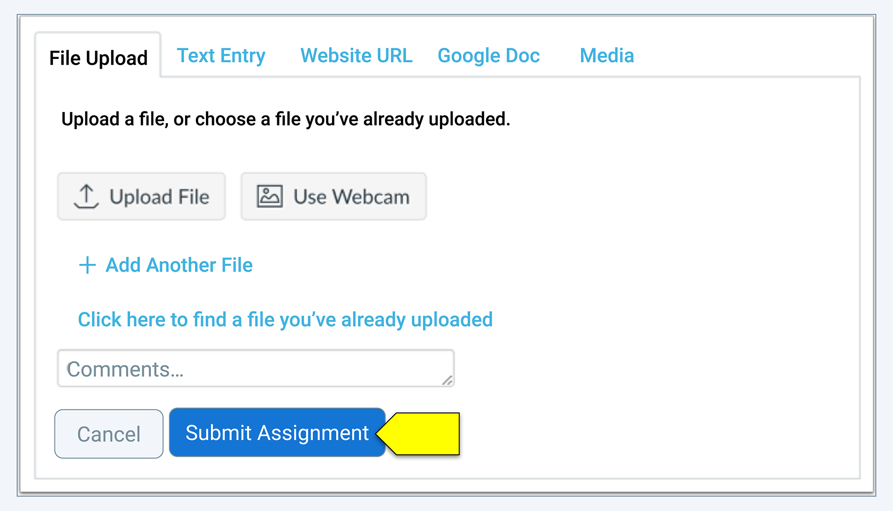

# Module 0: Getting Started

## Welcome

Welcome to the Data boot camp! In this course, you will gain the knowledge, skills, and expertise to turn data into actionable recommendations and insights. Let's get started!

In this module, you’ll learn more about the content and structure of the Data boot camp and how to use Canvas to access and submit your assignments. By the end of Module 0, you will be able to:

* Describe the content, structure, and policies associated with the Data boot camp.
* Access course materials in Canvas.
* Submit assignments in Canvas.
* Set up your Canvas notifications.
* Plan how you will organize your workspace and time throughout the boot camp.
* Prepare for your first day of class.

Each lesson in this module is self-paced and fully asynchronous. Plan to spend some time reviewing the content in this module before your first class.

Start by completing your bootcamp orientation. The Orientation videos provide an overview of information to help you get ready for class. As you navigate through Module 0 you will find more in depth information on technology used for class, class requirements and expectations as well as tools on how to succeed in the program.

### TECHNOLOGY TIPS

Technology Tools:

<iframe class="wistia_embed" title="Tech Overview - ASKBCS,GitLab&amp;GitHub Video"
    src="https://fast.wistia.net/embed/iframe/vs68ty0n8y?seo=false" width="640" height="360" name="wistia_embed"
    allow="autoplay; fullscreen"></iframe>

BCS Overview:

<iframe class="wistia_embed" title="BCS Overview-6.1 Video"
    src="https://fast.wistia.net/embed/iframe/8ljbsznkdc?seo=false" width="640" height="360" name="wistia_embed"
    allow="autoplay; fullscreen"></iframe>

### STUDENT SUCCESS

Tips for success:

<iframe class="wistia_embed" title="Tips for Success Video"
    src="https://fast.wistia.net/embed/iframe/1tb8qq8vkl?seo=false" width="640" height="360" name="wistia_embed"
    allow="autoplay; fullscreen"></iframe>

Student Support:

<iframe class="wistia_embed" title="Student Support: LA Video"
    src="https://fast.wistia.net/embed/iframe/k8w9i32o9q?seo=false" width="640" height="360" name="wistia_embed"
    allow="autoplay; fullscreen"></iframe>

Career Services:

<iframe class="wistia_embed" title="Career Services Video"
    src="https://fast.wistia.net/embed/iframe/982nzk14cz?seo=false" width="640" height="360" name="wistia_embed"
    allow="autoplay; fullscreen"></iframe>

### HOW TO VIDEOs

How to join class:

<iframe class="wistia_embed" title="How to Join Class Video"
    src="https://fast.wistia.net/embed/iframe/kzhnhjwe0u?seo=false" width="640" height="360" name="wistia_embed"
    allow="autoplay; fullscreen"></iframe>

How to request a tutor:

<iframe class="wistia_embed" title="How to Request A Tutor-Calendly Video"
    src="https://fast.wistia.net/embed/iframe/5fgn7qsder?seo=false" width="640" height="360" name="wistia_embed"
    allow="autoplay; fullscreen"></iframe>

Time Zone & Calendar:

<iframe class="wistia_embed" title="BCS: Changing Time Zone &amp; Linking Calendars Video"
    src="https://fast.wistia.net/embed/iframe/5tg5ilqy4e?seo=false" width="640" height="360" name="wistia_embed"
    allow="autoplay; fullscreen"></iframe>

### COMPLETION REQUIREMENT & CLASS EXPECTATIONS

To read more in-depth information about boot camp completion requirements, check out the syllabus.

Orientation Completion Confirmation Form:

<iframe
    src="https://docs.google.com/forms/d/e/1FAIpQLSeloKPCFNLX28nTM9IoZGvEz_BRn5u6fIysCzIiRPRgi9rAcw/viewform?embedded=true"
    width="640" height="948"></iframe>

[TRANSCRIPT](https://fsf.my.canva.site/t-transcripts)

## Navigating This Course

### Overview

This learning environment includes many tools and resources to support you throughout your boot camp journey.

### What You’ll Learn

By the end of this lesson, you’ll be able to navigate the content and tools provided within this learning environment.

### 0.1 Activities

 

1. Review the left navigation pane.

    * The Modules link directs you to course content and activities.

    * The Syllabus link provides access to the course syllabus.

    * The Grades link directs you to a list of forthcoming assignments. This is also where you can check grades for any submitted assignments.

    * The Zoom link provides access to virtual class meetings and class recordings.

    * The Attendance link is where you can check your current attendance.

    * The Student Support link is where you can request help from your student support team, including contacting your Student Success Manager (SSM) and submitting technical issue tickets.

      * If there is an error in your attendance, contact student support by using the Student Support link.

    * The Career Services link provides access to the entire Career Engagement Network, including access to milestones, events, resources, and other career services offerings. This is also where you will submit your career services milestones.

    * The Career Events link takes you to the Career Engagement Network, where you can find information about events, browse the job board, and access other tools and resources.

2. Visit the Career Services and Career Events links to learn more about some of the resources available to you.

## Reviewing the Course Syllabus

### Overview

The syllabus includes information about the structure and content of the boot camp, the assignments you’ll complete, and other information and policies that are important for your success.

### What You’ll Learn

By the end of this lesson, you’ll be able to describe the content, structure, and policies associated with the Data boot camp.

### 0.2 Activities

Download and review the Data boot camp syllabus. You can also access the syllabus through the Syllabus link in the navigation pane.

Questions about the information in the syllabus? Contact your SSM.

## Preparing for Class

### Overview

On this platform, you'll find all the information you need to prepare for each class. In this lesson, you'll learn how the course materials are organized and how to prepare for class each day.

### What You’ll Learn

By the end of this lesson, you’ll be able to access the course materials.

### 0.3 Activities

1. Read the following overview of how the course materials are organized:

    * Each week of the boot camp covers one module.

    * Within each module (week), there are three lessons. Each lesson takes place during one class session and has its own page on this platform.

    * You'll get access to each module’s materials one week in advance.

    * Before the start of each class session, log in and navigate to that week’s module.

    * Click on the lesson for that day (for example, Lesson 1.1 or Lesson 1.2) and you'll find the activity files you'll need.

    * Make a copy of the activity files and add them to your GitHub repository before each class so you can easily access them. This is important so you spend your valuable class time working on activities instead of organizing files.

    * Your instructor will let you know when to work on each activity during class.

2. Review the directions for saving to GitHub. (optional)

3. Prepare for your first class:

    * Review the structure and content of Module 1.

    * Make a copy of the activity files for your first class and save them to your GitHub repository.

## Submitting Assignments

### Overview

You will submit your weekly assignments on this platform. Before submitting an assignment, review all the relevant information, including the rubric.

### What You’ll Learn

By the end of this lesson, you’ll know how to submit assignments.

### 0.4 Activities

Review the following instructions to learn how to submit assignments.

### Open Assignments

Navigate to the Assignment page within the week's module.

**Note:** You can also access your assignments through your user or course dashboard, the syllabus, grade book, or calendar.

### Start Assignment

To submit an assignment, click the **Start Assignment** button located near the assignment title.

### Select Submission Type

There are several submission types available for assignments. Each assignment's instructions typically indicate the type of submission you should use. Because many assignments have multiple components, the most common method is to submit a website URL to a collection of files. For this type of submission, select the Website URL submission type. In a separate tab or browser window, go to Google Drive or GitHub and copy the link to your assignment folder, document, or repository. Make sure the folder/file permissions are updated so your instructor and TA can access your assignment. Paste the link into the Website URL field.

Available submission types often vary by assignment. (They will be listed at the beginning of the assignment.) You can only select one submission type per assignment. Once you've clicked on the submission type, directions will appear. The following example is for a file upload.

#### Submit Assignment

When you're ready to submit your assignment, click the **Submit Assignment** button.

**Note:** Large files submitted using the File Upload tab may display a submission status indicator.

### Resubmit an Assignment

If you need to resubmit an assignment, navigate to the assignment's page (through the Grades, Syllabus, or Modules link). Click the button near the title to begin your resubmission. Follow the same steps as for the first submission.

## Grade Notifications

### Overview

When you log in to this platform, there may be alerts and notifications about grades and course updates. In this lesson, you’ll learn how to access your grades and set up notifications.

### What You’ll Learn

By the end of this lesson, you’ll be able to set up notifications.

### 0.5 Activities

1. Review the following information about grade notifications:

    * Once your assignment has been graded, an alert will appear next to the Grades link in the course navigation.

    * On the Grades page, you can find details about your assignments and links to additional feedback.
    * You can also set your notification preferences so you're notified when grades have been posted.

2. Set your notification preferences for the boot camp. From your Canvas dashboard, click on Account and then Notifications. You can set your notification preferences for grades in the Course Activities section (locate the Grading row). Review your other notification options and set them up according to your preferences.

## Tips for Success

### Overview

We’re excited that you’ve committed to this boot camp. While this course is a rigorous and fast-paced learning experience, it's also incredibly rewarding. Take the time to read through the guidelines and expectations and the suggested strategies for success. Review the resources here to guide you through this program. In this lesson, you’ll review some tips for a successful boot camp experience.

### What You’ll Learn

By the end of this lesson, you’ll be able to organize your workspace and time throughout the boot camp.

### 0.6 Activities

1. Review this list of tips:

    * Attend as many Office Hours sessions throughout the week as you can.

    * Remember that you’re not alone, especially early in the course. If you’re struggling, others are too. Make connections. Help your peers, and ask for their help as needed. Set up a study group.

    * Connect with your SSM for non-curriculum support. Your SSM is dedicated entirely to your success and can guide you with any support that you need.

    * Focus on the big picture&mdash;beyond the specific skills of the week. A key element of this boot camp is getting comfortable researching and exploring new tools. This is a key skill in the career space, and our industry is always evolving. Skills will change as technology changes, but the critical thinking techniques that you learn in this course will help you evolve with the field.

    * Celebrate your wins and those of your peers. If you’re feeling proud of a creation or a hurdle that you’ve overcome, share it in Slack!

2. Decide how to set up your workspace. Where will you locate your workstation? For working on challenges and projects? Identify a safe, quiet place to work, and discuss your plans with your family and friends to ensure that you get the support and space you need.

3. Establish your weekly schedule. When will you review your notes? Work on the weekly Challenges? What are the best times for study groups or group project meetings?

4. Sync your class calendar with your phone or web calendars so you can easily access your assignment and virtual class dates.

    * Access the course calendar through the calendar icon in the main navigation bar.

    * Locate the Calendar Feed link and click to get an iCal link.

    * Copy the link and paste it into any calendar app that takes iCal feeds (Google Calendar, iCal, Outlook, etc.).

## Module 0 Checklist

## Module 0 Review

### Congratulations on Completing Module 0!

We hope you're excited about your first class!

You should now be able to:

* Describe the content, structure, and policies associated with the Data boot camp.

* Access course materials.

* Submit assignments.

* Set up notifications.

* Plan how to organize your workspace and time throughout the boot camp.

If you have questions about any of these topics or would like additional support, contact your SSM.

This module will be available to you throughout the boot camp. Come back any time you'd like to review this information. Enjoy your first week of class!
