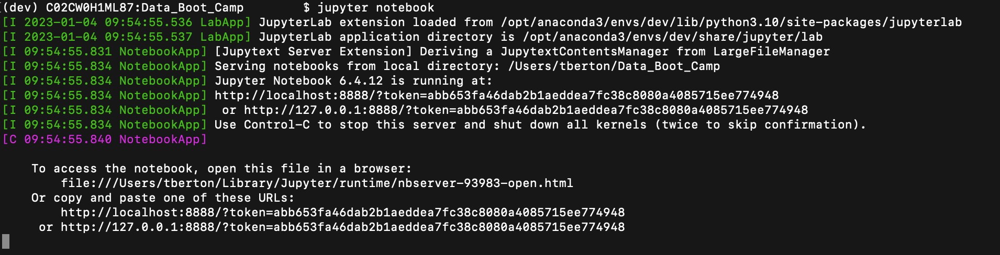

Make sure that you have installed Anaconda and Jupyter Notebook before starting the lessons for this week.

### Overview of Anaconda

Anaconda is a free, open-source distribution software with over 1,500 packages for Windows and macOS. One of those packages is Jupyter Notebook. When you download and install Anaconda, you will have access to Jupyter Notebook along with many other packages. Essentially, Jupyter Notebook is to Anaconda what Microsoft Word is to Microsoft Office.

Anaconda packages support the Python and R programming languages for data science, machine learning, data processing, and other data-related tasks. We'll be using Python in this module.

Choose the appropriate installation video for your operating system, and check out the [Anaconda documentation](https://docs.anaconda.com/anaconda/install/) if you need further assistance.

### Install Anaconda on macOS

1. Go to the [Anaconda Distribution Page](https://www.anaconda.com/distribution/).

2. Click Download, and select the latest Python version.

3. Follow the steps in the visual installer.

#### Check Your Anaconda Installation

As a best practice, you should always check the version of the software you installed and confirm that it's installed correctly. Let's take care of this now for Anaconda.

Open the command line and run the command `conda --version`. If the command line returns `conda 22.9.0` or later, the software is installed correctly.

You need to type "conda" and not "anaconda" because Anaconda packages are managed by the package management system "conda." Anaconda is the distribution management system.

Note that package versions change often, so you may need to update the packages managed by conda. To find out what version of conda you have on your computer, type and run `conda  --version` in the command line. If the command line returns `conda 22.9.0` or later, you should have the latest version of conda.

### Install Anaconda on Windows

1. Go to the [Anaconda Distribution Page](https://www.anaconda.com/distribution/).

2. Click Download, and select the latest Python version.

3. Open the installer, and then follow the instructions.

    **Important:** Make sure to select the "Add Anaconda to my PATH environment variable" checkbox.

    

#### Check Your Anaconda Installation

As a best practice, you should always check the version of the software you installed and confirm that it's installed correctly. On Windows, we can do this using the Anaconda Prompt (just like how we checked the version of Python with the Python Prompt).

> **Rewind** On Windows 10, to find the application you want to open
> type the name in the search bar.

In the search bar, type "Anaconda Prompt."


The Anaconda Prompt should look like the following:

```shell
(base) C:\Users\your_home_directory>
```

After the prompt, `>`, type and run `conda --version`. If the prompt returns `conda 22.9.0` or later, the software is installed correctly.

You need to type "conda" and not "anaconda" because Anaconda packages are managed by the package management system "conda." Anaconda is the distribution management system.

Note that package versions change often, so you may need to update the packages managed by conda. To find out what version of conda you have on your computer, type and run `conda --version` in the command line. If the command line returns `conda 22.9.0` or later, you should have the latest version of conda.

If you need to get the latest version of conda and other packages, perform the following steps (these steps are the same for both macOS and Windows).

1. Type and run `conda update conda` to update the packages distributed by Anaconda.

2. Run `conda --version` to check if conda was updated.

### What is a Development Environment?

Creating a development environment is a common practice for programmers. A **development environment,** or **virtual environment,** is an isolated working copy of the coding environment that programmers use to install different versions of software packages for specific projects. Some projects may require the latest versions of software, and some may require older versions.


A virtual environment is like a sandbox that contains the toys you want to play with for specific activities. You’ll be creating a virtual environment that includes the modules and packages you need for your Python projects. Unlike a sandbox at a playground, you can leave this virtual sandbox anytime, and all the toys will still be there when you come back!

In the virtual environment, we can switch or move between environments, which is called **activating the environment**. When we activate the virtual environment, we know that we have the right packages for our projects.

We're going to create a virtual Conda environment that runs Python 3.10 and contains all the Anaconda packages that work with the latest version of Python 3.10. Note that some of these packages may be older versions than the ones you installed with Anaconda. This is because for this course, we need to use the Anaconda packages that work with the latest version of Python 3.10.

The following videos guide you through the process of creating a virtual environment. Review the video that corresponds to your operating system. You can also follow along using the provided written directions.

#### Create a Development Environment

<iframe src="https://fast.wistia.net/embed/iframe/s41qloknvp?videoFoam=true" title="Creating a Python Development Environment (Mac) Video" allow="autoplay; fullscreen" allowtransparency="true" frameborder="0" scrolling="no" class="wistia_embed" name="wistia_embed" msallowfullscreen width="640" height="360"></iframe>

> **Important** Use this video as a guide. Instead of creating a `PythonData` environment with Python 3.7, you will create a `dev` environment using Python 3.10 using the steps below.

1. Open Terminal on macOS or Anaconda Prompt on Windows and to then run the following command:

    `conda create -n dev python=3.10 anaconda -y`

    * The installation might take a few minutes.

2. At the command line, run `conda activate dev` to activate the environment. When `(dev)$` appears, you’re in the conda environment.

    * To view all of your conda environments, type `conda info --envs` in the command line and press Enter. You should have at least two conda environments, "base" and "dev," as in the following:

        ```text
        base                /opt/anaconda3
        dev               * /opt/anaconda3/envs/dev
        ```

3. Now, make sure that you’re using the correct version of Python in this environment. In the command line, type `python --version` and press Enter. The output should be, `Python 3.10.4` or greater.

> **Note** For more information, read the [documentation for creating a
> development environment](https://conda.io/projects/conda/en/latest/user-guide/tasks/manage-environments.html#creating-an-environment-with-commands).

#### Delete a Development Environment

If you didn't create your environment correctly, you will need to remove that environment and create the correct `dev` environment.

To remove an environment from your computer, follow these steps:

1. In the command line, type `conda deactivate`.
2. Next, type and run `conda remove --name <env_name> --all` to delete the environment. For example, if the environment is called `dev`, you would run the following: `conda remove --name dev --all`.

If you need to recreate the development environment, follow the steps in the previous section or review the video.

#### Deactivate a Development Environment

When you want to update Anaconda on your computer, it's a best practice to deactivate your development environment before doing so. To deactivate the environment, type `conda deactivate` in the command line and press Enter.

> **Note** For more information about the topics covered so far in this
> module, check out the following documentation:
>
> * [Activating a development
>     environment](https://conda.io/projects/conda/en/latest/user-guide/tasks/manage-environments.html#activating-an-environment)
> * [Deactivating a development
>     environment](https://conda.io/projects/conda/en/latest/user-guide/tasks/manage-environments.html#deactivating-an-environment)
> * [Deleting a development
>     environment](https://conda.io/projects/conda/en/latest/user-guide/tasks/manage-environments.html#removing-an-environment)

### Overview of Jupyter Notebook

Jupyter Notebook is an open-source, web-based application that allows users to create and share documents that contain live code, equations, visualizations, and explanatory text. It combines a console, a text editor, and a file browser for your folders into one web-based application.

Jupyter Notebook is a popular tool for data analysts and scientists. It allows us to import data from a variety of formats. We can clean data and merge similar datasets. We can filter data based on conditionals, slice it on specific ranges, sort it based on values, and group it into similar categories. Jupyter Notebook can also be used to visualize data, write SQL queries, perform statistical analysis, and build and train machine learning models.

#### Launch Jupyter Notebook

To launch Jupyter notebook, first open Terminal (macOS) or the Anaconda Prompt (Windows). Additionally, make sure you're in the Conda `dev` development environment, then follow these steps to launch Jupyter notebook:

1. In your open terminal window (Terminal for macOS or Anaconda Prompt for Windows), confirm that the term `(dev)` appears at the beginning of your command prompt. Then type `conda activate dev`.

2. Type `jupyter notebook`. An instance of the Jupyter notebook user interface automatically opens in your browser.

> **Hint** If an instance doesn’t automatically open, copy the URL from your terminal window to your browser to manually open an instance. The URL will be similar to the following:
>
>

#### Navigate the Jupyter Notebook Workspace

The following screenshot shows a folder structure similar to the one you'll see when you launch Jupyter Notebook.


You’ve completed the setup required for this module, and you're all set to start the first lesson!
